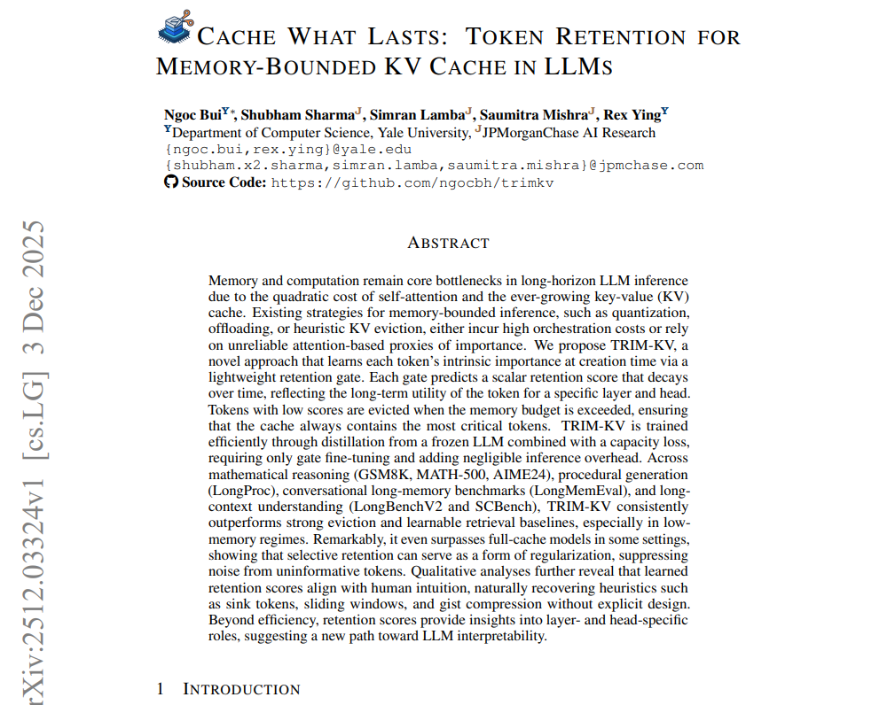

# TrimKV: Memory-Bounded KV Cache

Reference-style implementation of **Cache What Lasts: Token Retention for
Memory-Bounded KV Cache in LLMs** ([arXiv:2512.03324](https://arxiv.org/abs/2512.03324)).



TrimKV learns which tokens are worth keeping in the KV cache. A small retention
gate predicts a score `beta` for every token and KV head when the token is
created. As decoding continues, that score decays as:

```text
current_score(i, t) = beta_i ** (t - i)
```

When a layer cache grows beyond the budget `M`, the lowest-scoring tokens are
evicted. During training, the same retention scores are used as an additive
attention-logit bias so the gates can learn through gradients.

## What This Repo Implements

- Retention gate: a per-layer MLP that predicts per-KV-head token scores.
- Retention-weighted attention: standard attention plus the TrimKV decay bias.
- Memory-bounded KV cache: append new KV states, score live tokens, evict by budget.
- Gate-only training loop: frozen teacher/base model with distillation,
  next-token CE, and the capacity penalty.
- Qwen3 integration: a thin wrapper that patches Qwen3 attention modules without
  changing the base model weights.

This is intentionally readable PyTorch code. It is meant for understanding and
experimentation, not a fully optimized FlashAttention/Triton reproduction.

## Extra Work Done Here

Compared with a minimal paper sketch, this repo adds:

- A standalone `TrimKVCache` that can be inspected and tested without loading a
  full LLM.
- Grouped-query attention support, so Qwen-style `H_q > H_kv` layouts work.
- Layer-local cache step tracking, which keeps token ages correct across all
  decoder layers.
- Full-sequence retention bias during training, so the student path actually
  receives gate gradients from attention behavior.
- A small Qwen3 smoke-test script for generation with a fixed memory budget.

## Repository Layout

```text
KV-Cache-memory-bound/
+-- assets/i1.png              # paper screenshot used in this README
+-- examples/test_qwen3.py     # inference smoke test
+-- train/train.py             # gate-only training script
+-- trimkv/
|   +-- attention.py           # retention-weighted attention
|   +-- cache_utils.py         # memory-bounded KV cache
|   +-- losses.py              # distillation and capacity losses
|   +-- retention_gate.py      # MLP retention gate
|   +-- models/qwen3.py        # Qwen3 wrapper and attention patch
+-- requirements.txt
+-- setup.py
```

## Requirements

Minimum:

- Python 3.10+
- PyTorch 2.3+
- Transformers 4.53+ with Qwen3 support
- Accelerate, datasets, einops, numpy, tqdm

Recommended for real model tests:

- CUDA GPU with bf16 support
- Enough VRAM for the selected Qwen3 model
- Hugging Face access to the model weights

CPU can run the small shape checks, but it is not practical for real Qwen3
generation or training.

## Install

From this repository:

```bash
python -m venv .venv
.\.venv\Scripts\activate
pip install -r requirements.txt
pip install -e .
```

If you are using CUDA, install the PyTorch build that matches your CUDA version
before installing the rest of the requirements.

## Quick Local Checks

These checks do not download any model weights:

```bash
python -m compileall trimkv train examples
```

```bash
python - <<'PY'
import torch
from trimkv.attention import retention_weighted_attention
from trimkv.cache_utils import TrimKVCache
from trimkv.losses import capacity_loss

q = torch.randn(2, 4, 3, 8)
k = torch.randn(2, 2, 5, 8)
v = torch.randn(2, 2, 5, 8)
out = retention_weighted_attention(q, k, v, torch.zeros(2, 2, 3, 5))
assert out.shape == (2, 4, 3, 8)

cache = TrimKVCache(num_layers=2, memory_size=3)
for layer in range(2):
    beta = torch.rand(2, 5, 2) * 0.5 + 0.5
    live_k, _, _ = cache.update(
        layer,
        torch.randn(2, 2, 5, 8),
        torch.randn(2, 2, 5, 8),
        beta,
    )
    assert live_k.shape[-2] == 3
    assert cache.current_step(layer) == 5

assert capacity_loss([torch.rand(2, 4, 2)], memory_size=2).ndim == 0
print("checks passed")
PY
```

PowerShell does not support Bash heredocs directly. For PowerShell, use:

```powershell
@'
import torch
from trimkv.attention import retention_weighted_attention
from trimkv.cache_utils import TrimKVCache

q = torch.randn(2, 4, 3, 8)
k = torch.randn(2, 2, 5, 8)
v = torch.randn(2, 2, 5, 8)
out = retention_weighted_attention(q, k, v, torch.zeros(2, 2, 3, 5))
assert out.shape == (2, 4, 3, 8)

cache = TrimKVCache(num_layers=2, memory_size=3)
for layer in range(2):
    beta = torch.rand(2, 5, 2) * 0.5 + 0.5
    live_k, _, _ = cache.update(layer, torch.randn(2, 2, 5, 8), torch.randn(2, 2, 5, 8), beta)
    assert live_k.shape[-2] == 3
print("checks passed")
'@ | python -
```

## Qwen3 Smoke Test

This downloads/loads model weights, so run it only after the environment is set
up correctly:

```bash
python examples/test_qwen3.py \
  --model Qwen/Qwen3-1.7B \
  --memory-size 256 \
  --prompt "Summarise the plot of Hamlet in three sentences." \
  --max-new-tokens 64
```

The gates start near full retention. This is useful for stability, but quality
under tight budgets requires training the gates.

## Train Retention Gates

Create a JSONL file:

```jsonl
{"text": "A training sample goes here."}
{"text": "Another long-context or generation-style sample."}
```

Then run:

```bash
python train/train.py \
  --model Qwen/Qwen3-1.7B \
  --dataset-path data.jsonl \
  --memory-size 512 \
  --lambda-cap 1.0 \
  --ce-weight 0.5 \
  --steps 2000
```

The script freezes the base model and trains only `student.gates`. Checkpoints
are saved to:

```text
checkpoints/gates_M{memory_size}/gates.pt
```

Load a trained gate checkpoint during inference:

```bash
python examples/test_qwen3.py \
  --model Qwen/Qwen3-1.7B \
  --memory-size 512 \
  --gate-ckpt checkpoints/gates_M512/gates.pt
```

## Paper-to-Code Map

| Paper concept | Code |
| --- | --- |
| Retention gate `g(x)` | `trimkv/retention_gate.py` |
| Retention-biased attention | `trimkv/attention.py` |
| Budgeted KV eviction | `trimkv/cache_utils.py` |
| Capacity loss | `trimkv/losses.py` |
| Distillation objective | `trimkv/losses.py` |
| Qwen3 model wiring | `trimkv/models/qwen3.py` |

## Current Limitations

- The attention path is plain PyTorch, not FlashAttention or Triton.
- The Qwen3 wrapper is a monkey patch for experimentation, not a packaged
  Hugging Face `Cache` subclass.
- Training uses an O(T^2) capacity-loss implementation, which is readable but
  not suitable for 128K-token training.
- The implementation targets Qwen3 first. Other decoder-only models need their
  own wrapper around projections, RoPE, and cache plumbing.
